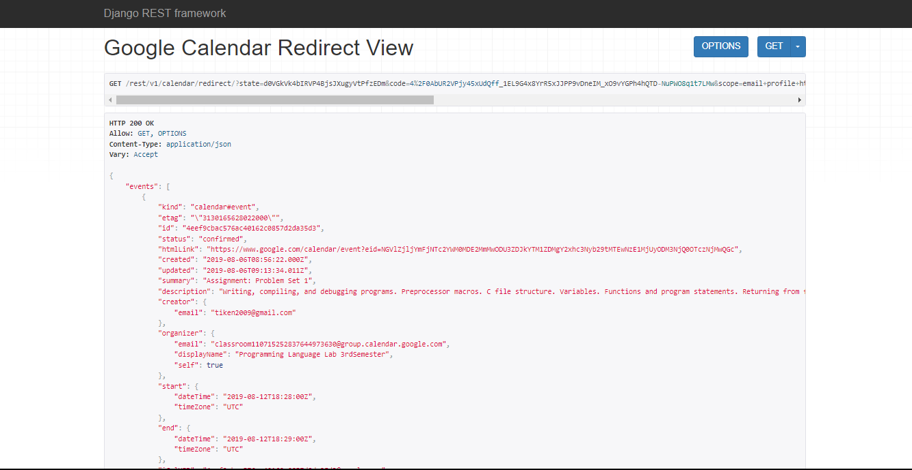

For run this project on a local machine: 

- Running the virtual environment

```sh
.\Scripts\activate
```
- Running the server

```sh
python manage.py runserver
```

- Endpoint:
```
/rest/v1/calendar/init/ -> google_calendar_init_view()
```
This view should start step 1 of the OAuth. Which will prompt user for his/her credentials

```
/rest/v1/calendar/redirect/ -> google_calendar_redirect_view()
```



